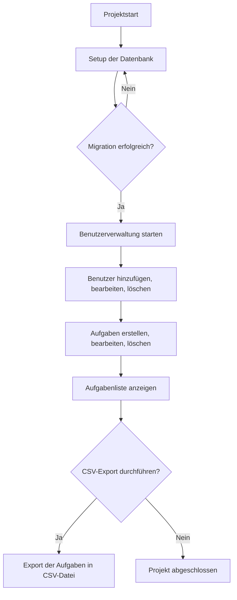

# 📋 Ablaufplanung für das Task Management System

## 🔍 Übersicht
Die Ablaufplanung zeigt den Schritt-für-Schritt-Prozess zur Implementierung und Nutzung des Task Management Systems. Die wichtigsten Komponenten sind: Benutzerverwaltung, Aufgabenmanagement und die CSV-Export-Funktion. Diese Ablaufplanung deckt den gesamten Prozess ab — von der Konfiguration bis zur finalen Anwendung.

---

## 🗂️ Struktur des Projekts
1. **Datenbank-Setup**
   - Konfiguration der Verbindungszeichenzeichenfolge (`App.config`)
   - Initiale Migration zur Erstellung der Datenbank
   - Seed-Daten hinzufügen (Standardbenutzer)

2. **Benutzerverwaltung**
   - Benutzer erstellen, bearbeiten und löschen
   - Dropdown-Liste zur Auswahl vorhandener Benutzer

3. **Aufgabenmanagement**
   - Aufgaben erstellen, anzeigen, bearbeiten und löschen
   - Felder validieren und Benutzer zuweisen

4. **Datenexport**
   - Export der Aufgabenliste in eine CSV-Datei
   - Dialogfenster zur Auswahl des Speicherorts anzeigen

---

## 📌 Detaillierte Ablaufplanung

### 🔧 1. Setup und Konfiguration
- **1.1.** Visual Studio öffnen und das Projekt `TaskManagementSystem` laden.
- **1.2.** Verbindungszeichenfolge in der `App.config` anpassen:
  
    ```xml
    <connectionStrings>
        <add name="TaskManagementDB"
             connectionString="Server=DEIN_SERVER;Database=TaskManagementDB;Trusted_Connection=True;"
             providerName="System.Data.SqlClient" />
    </connectionStrings>
    ```

- **1.3.** Führe folgende Migrationen in der `Package Manager Console` aus:
  
    ```bash
    Enable-Migrations
    Add-Migration InitialCreate
    Update-Database
    ```

- **1.4.** Seed-Daten sicherstellen (Benutzer wird automatisch in `Configuration.cs` angelegt).

### 👥 2. Benutzerverwaltung
- **2.1.** Benutzer hinzufügen:
  - In das `Neuen Benutzer eingeben`-Textfeld den gewünschten Benutzernamen eingeben.
  - Auf den Button `Benutzer hinzufügen` klicken.
  - Der Benutzer erscheint sofort im Dropdown `Benutzer auswählen`.

- **2.2.** Benutzer löschen:
  - Einen Benutzer aus dem Dropdown `Benutzer auswählen` auswählen.
  - Auf den Button `Benutzer löschen` klicken.
  - Der Benutzer wird sofort aus der Liste entfernt.

- **2.3.** Benutzer auswählen:
  - Dropdown-Liste `Benutzer auswählen` verwenden, um den Benutzer für die Aufgabe auszuwählen.

### ✅ 3. Aufgabenverwaltung
- **3.1.** Aufgabe erstellen:
  - Felder `Titel eingeben` und `Beschreibung eingeben` ausfüllen.
  - Benutzer aus der Dropdown-Liste `Benutzer auswählen` auswählen.
  - Auf den Button `Erstellen` klicken.
  - Aufgabe wird in der Datenbank gespeichert und in der Liste angezeigt.

- **3.2.** Aufgabe bearbeiten:
  - Eine Aufgabe in der Liste auswählen.
  - Felder `Titel` und `Beschreibung` anpassen.
  - Auf den Button `Ändern` klicken.
  - Die geänderten Daten werden gespeichert und die Liste aktualisiert.

- **3.3.** Aufgabe löschen:
  - Eine Aufgabe in der Liste auswählen.
  - Auf den Button `Löschen` klicken.
  - Die Aufgabe wird aus der Datenbank entfernt und die Liste wird aktualisiert.

### 📤 4. CSV-Export
- **4.1.** Export der Aufgabenliste:
  - Auf den Button `CSV Export` klicken.
  - Ein Dialogfenster öffnet sich zur Auswahl des Speicherorts.
  - Den gewünschten Pfad auswählen und speichern.
  - Die Aufgabenliste wird als CSV-Datei exportiert.

---

## 🔄 Ablaufdiagramm (Flow Chart)



---

## 🛠️ Vor- und Nachbedingungen

### 📌 Vorbedingungen:
- Die Verbindung zur Datenbank muss korrekt konfiguriert sein (`App.config`).
- Alle Migrationen müssen ausgeführt und die Datenbank sollte auf dem neuesten Stand sein.
- Benutzer müssen vorhanden sein, bevor Aufgaben erstellt werden können.

### 📌 Nachbedingungen:
- Erfolgreich durchgeführte Aktionen (Erstellen, Bearbeiten, Löschen) sollten in der `dataGridView` sichtbar sein.
- CSV-Export sollte eine vollständige Liste aller Aufgaben in der gewählten Datei speichern.

---

## ⚠️ Fehlerbehandlung
- **Fehler:** "Verbindung zur Datenbank konnte nicht hergestellt werden."
  - **Lösung:** Überprüfe die Verbindungseinstellungen in der `App.config`.
  
- **Fehler:** "Benutzer ist bereits vorhanden."
  - **Lösung:** Vermeide das Hinzufügen von Benutzern mit identischen Namen.

- **Fehler:** "Migrationen konnten nicht angewendet werden."
  - **Lösung:** Überprüfe, ob alle erforderlichen Migrationen erstellt wurden und führe `Update-Database` aus.

---

## 📂 Verzeichnisstruktur
```
TaskManagementSystem/
├── DataAccess/
│   ├── AppDbContext.cs
│   ├── TaskRepository.cs
│   └── UserRepository.cs
├── Migrations/
│   ├── Configuration.cs
│   ├── InitialCreate.cs
│   └── Seed.cs
├── Models/
│   ├── Task.cs
│   └── User.cs
├── Views/
│   ├── Form1.cs
│   ├── Form1.Designer.cs
│   └── Program.cs
└── App.config
```
